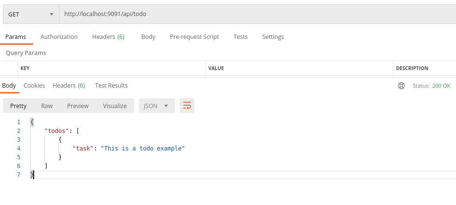
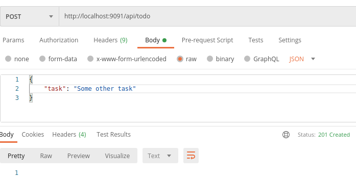

# TODO App
   
We want to build a TODO web app.

It will allow the users to keep track and organize their tasks.

Your objective is to do the following user story.

```
As a user
I want to be able to add a TODO item
so I can track the things I want to do.
```

The app has two parts, a frontend built in React and a Backend built in NodeJS.

The backend exposes an API to fetch the TODO items, that are be displayed in the page.

We provide the full backend, you only need to focus on the frontend part.

You'll notice that there's almost no styling beying done in the app. If you have time provide a better user experience.

## Starting the application

- Backend: (In the backend folder)
```shell
npm install
npm start # Start the server in the 9091 port
```

- Frontend: (In the root folder)
```shell
npm install
npm start # Starts the app in http://localhost:3000
```

## Backend

You can find it in the `/backend` directory. It's built in Express and stores the TODO items in memory.

* GET /api/todo



* POST /api/todo



## Frontend

You can find it in the `src` folder. It has been build with React and Redux. The list of todos are fetched asynchronously from the backend via Redux-thunk.

You can assume the backend is running under `http://localhost:9091/api/todo`


